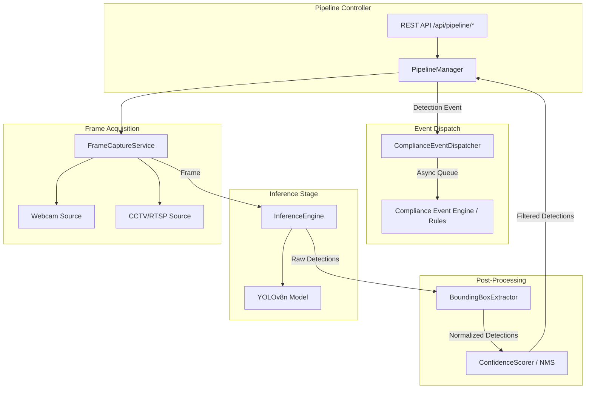

# Design Document: AI Detection Pipeline

## Overview

The AI Detection Pipeline formalizes the existing detection architecture in `backend/core/` and `backend/workers/detection_worker.py` into a well-defined, stage-based pipeline with clear component boundaries, structured data flow, and REST API control endpoints. The pipeline orchestrates five discrete stages — frame capture, inference, bounding box extraction, confidence scoring, and compliance event dispatch — each encapsulated in its own module with typed interfaces.

The refactoring preserves backward compatibility with the existing `DetectionWorker` while introducing:
- A formal `FrameCaptureService` supporting webcam and CCTV/RTSP sources with reconnection logic
- A decoupled `InferenceEngine` wrapping YOLOv8n with graceful error handling
- A `BoundingBoxExtractor` that normalizes and validates raw model output
- A `ConfidenceScorer` implementing threshold filtering and Non-Maximum Suppression (NMS)
- An async `ComplianceEventDispatcher` with buffered retry semantics
- REST API endpoints under `/api/pipeline/` for start, stop, status, config, and detections
- Paper material (book) detection integrated into the existing class filter

### Design Rationale

The current `DetectionWorker` is a monolithic loop that captures, infers, classifies, annotates, and publishes frames in a single method. This design decomposes that loop into pipeline stages so each stage can be independently tested, configured, and extended. The compliance event dispatcher is introduced to decouple incident classification (existing `rules.py`) from the detection pipeline, enabling async event delivery without blocking the frame loop.

## Architecture



### Pipeline Flow (per frame)

1. `FrameCaptureService.read()` → returns `Frame` (numpy array) or raises
2. `InferenceEngine.infer(frame)` → returns raw `list[RawDetection]`
3. `BoundingBoxExtractor.extract(raw_detections, frame_shape)` → returns `list[Detection]`
4. `ConfidenceScorer.filter(detections, threshold)` → returns sorted `list[DetectionResult]`
5. `ComplianceEventDispatcher.dispatch(event)` → non-blocking enqueue

The `PipelineManager` orchestrates the loop, tracks metrics, and exposes state via the API.

## Components and Interfaces

### 1. FrameCaptureService

**Module:** `backend/core/frame_capture.py`

```python
@dataclass
class FrameCaptureConfig:
    source_type: Literal["webcam", "cctv"]
    source_id: int | str          # camera index or URL
    width: int = 960              # 320–1920
    height: int = 540             # 240–1080
    fps_limit: int = 2            # 1–30
    reconnect_attempts: int = 3
    reconnect_interval: float = 2.0
    connection_timeout: float = 10.0


class FrameCaptureService:
    def __init__(self, config: FrameCaptureConfig) -> None: ...
    def open(self) -> None: ...
    def read(self) -> np.ndarray: ...
    def release(self) -> None: ...
    @property
    def is_open(self) -> bool: ...
```

**Responsibilities:**
- Opens webcam via integer index or CCTV via RTSP/HTTP URL
- Validates URL scheme (rtsp:// or http://) for CCTV sources
- Implements reconnection logic (3 attempts, 2s interval) for CCTV failures
- Rate-limits frame reads to configured FPS
- Reports `SourceUnavailableError` on permanent failure
- Releases capture resource on `release()` within 5 seconds

### 2. InferenceEngine

**Module:** `backend/core/inference_engine.py`

```python
@dataclass(frozen=True)
class RawDetection:
    class_id: int
    label: str
    confidence: float
    bbox_raw: tuple[float, float, float, float]  # raw float coords from model


class InferenceEngine:
    TARGET_CLASSES: ClassVar[dict[int, str]] = {0: "person", 67: "cell phone", 73: "book"}

    def __init__(self, model_path: str = "yolov8n.pt", device: str = "auto") -> None: ...
    def infer(self, frame: np.ndarray, image_size: int = 640, confidence_threshold: float = 0.4) -> list[RawDetection]: ...
```

**Responsibilities:**
- Loads YOLOv8n model at init; raises `RuntimeError` if model path invalid
- Filters inference to target classes: person (0), cell phone (67), book (73)
- Returns empty list on inference failure (logs error, does not crash)
- Passes configured device and image_size to Ultralytics predict

### 3. BoundingBoxExtractor

**Module:** `backend/core/bbox_extractor.py`

```python
@dataclass(frozen=True)
class Detection:
    label: str
    confidence: float
    bbox: tuple[int, int, int, int]  # (x1, y1, x2, y2) normalized integers
    class_id: int


class BoundingBoxExtractor:
    @staticmethod
    def extract(raw_detections: list[RawDetection], frame_width: int, frame_height: int) -> list[Detection]: ...
```

**Responsibilities:**
- Converts raw float coordinates to integer pixel coords (truncate toward zero)
- Swaps coordinates if x1 >= x2 or y1 >= y2 to restore correct ordering
- Clamps to frame boundaries: [0, frame_width-1] for x, [0, frame_height-1] for y
- Discards detections with non-finite values (NaN, inf)
- Discards zero-area bounding boxes after normalization
- Maps class IDs to labels: 0→"person", 67→"cell phone", 73→"book"

### 4. ConfidenceScorer

**Module:** `backend/core/confidence_scorer.py`

```python
@dataclass(frozen=True)
class DetectionResult:
    label: str
    confidence: float
    bbox: dict  # {"x1": int, "y1": int, "x2": int, "y2": int}
    class_id: int


class ConfidenceScorer:
    DEFAULT_THRESHOLD: ClassVar[float] = 0.4
    NMS_IOU_THRESHOLD: ClassVar[float] = 0.5

    def __init__(self, threshold: float = 0.4) -> None: ...
    def filter(self, detections: list[Detection]) -> list[DetectionResult]: ...
    def set_threshold(self, threshold: float) -> None: ...

    @staticmethod
    def compute_iou(box_a: tuple[int,int,int,int], box_b: tuple[int,int,int,int]) -> float: ...
```

**Responsibilities:**
- Filters detections below the configured confidence threshold (equal-to-threshold retained)
- Validates threshold in [0.0, 1.0]; rejects invalid values with error, applies default 0.4
- Applies per-class Non-Maximum Suppression (IoU ≥ 0.5 → keep highest confidence)
- Ties broken by larger bounding box area
- Returns results sorted descending by confidence, ties broken by ascending class_id
- Produces `DetectionResult` with bbox as dict for JSON serialization

### 5. ComplianceEventDispatcher

**Module:** `backend/core/event_dispatcher.py`

```python
@dataclass
class DetectionEvent:
    timestamp: str        # ISO 8601 with timezone
    camera_id: str        # max 128 chars
    frame_width: int
    frame_height: int
    detections: list[DetectionResult]


class ComplianceEventDispatcher:
    BUFFER_CAPACITY: ClassVar[int] = 100
    RETRY_INTERVAL: ClassVar[float] = 5.0
    DISPATCH_TIMEOUT: ClassVar[float] = 3.0

    def __init__(self, event_engine: ComplianceEventEngine) -> None: ...
    async def dispatch(self, event: DetectionEvent) -> None: ...
    async def start(self) -> None: ...
    async def stop(self) -> None: ...
```

**Responsibilities:**
- Dispatches events asynchronously via non-blocking queue (≤5ms overhead)
- Buffers up to 100 events when downstream is unavailable (FIFO)
- Retries every 5 seconds; replays buffered events in chronological order on reconnect
- Discards oldest event and logs WARNING when buffer is full
- Does NOT dispatch when detection list is empty

### 6. PipelineManager

**Module:** `backend/core/pipeline_manager.py`

```python
@dataclass
class PipelineMetrics:
    running: bool
    frames_processed: int
    current_fps: float
    last_inference_ms: float
    error: str | None
    per_class_counts: dict[str, int]  # {"person": N, "cell phone": N, "book": N}


class PipelineManager:
    def __init__(self, config: AppConfig, db_session_factory: async_sessionmaker) -> None: ...
    def start(self, source_type: str, source_id: int | str) -> None: ...
    def stop(self) -> PipelineMetrics: ...
    def get_status(self) -> PipelineMetrics: ...
    def get_latest_detections(self) -> list[DetectionResult]: ...
    def update_config(self, **kwargs) -> dict: ...
```

**Responsibilities:**
- Orchestrates the frame capture → inference → extraction → scoring → dispatch loop
- Manages pipeline lifecycle (start/stop/error transitions)
- Tracks metrics: frames_processed, fps, inference_ms, per-class counts
- Enforces single-instance (409 Conflict on double-start/double-stop)
- Transitions to error state on unrecoverable failures (source permanently unavailable, 3 consecutive inference failures)
- Logs start/stop/error events at INFO level; inference cycles at DEBUG

### 7. Pipeline API Router

**Module:** `backend/routers/pipeline.py`

| Method | Path | Description |
|--------|------|-------------|
| GET | `/api/pipeline/status` | Pipeline health and metrics |
| POST | `/api/pipeline/start` | Start pipeline with source config |
| POST | `/api/pipeline/stop` | Stop pipeline, release resources |
| GET | `/api/pipeline/detections` | Latest detection results |
| PUT | `/api/pipeline/config` | Update runtime config |

**Request/Response schemas** defined via Pydantic models in `backend/schemas/pipeline.py`.

## Data Models

### Pydantic Schemas (`backend/schemas/pipeline.py`)

```python
from pydantic import BaseModel, Field, field_validator
from typing import Literal


class BoundingBox(BaseModel):
    x1: int = Field(ge=0)
    y1: int = Field(ge=0)
    x2: int = Field(ge=0)
    y2: int = Field(ge=0)


class DetectionResultSchema(BaseModel):
    label: str = Field(max_length=20)
    confidence: float = Field(ge=0.0, le=1.0)
    bbox: BoundingBox
    class_id: int = Field(ge=0)


class PipelineStartRequest(BaseModel):
    source_type: Literal["webcam", "cctv"]
    source_id: int | str

    @field_validator("source_id")
    @classmethod
    def validate_source_id(cls, v, info):
        if info.data.get("source_type") == "webcam":
            if not isinstance(v, int) or v < 0 or v > 10:
                raise ValueError("Webcam source_id must be integer 0–10")
        elif info.data.get("source_type") == "cctv":
            if not isinstance(v, str) or not (v.startswith("rtsp://") or v.startswith("http://")):
                raise ValueError("CCTV source_id must be rtsp:// or http:// URL")
        return v


class PipelineStartResponse(BaseModel):
    running: bool
    source_type: str
    source_id: int | str


class PipelineStopResponse(BaseModel):
    running: bool
    frames_processed: int


class PipelineStatusResponse(BaseModel):
    running: bool
    frames_processed: int
    current_fps: float
    last_inference_ms: float
    error: str | None
    per_class_counts: dict[str, int] = Field(default_factory=dict)


class PipelineConfigUpdate(BaseModel):
    confidence_threshold: float | None = Field(default=None, ge=0.0, le=1.0)
    image_size: int | None = Field(default=None, ge=320, le=1280)
    fps_limit: int | None = Field(default=None, ge=1, le=30)


class PipelineConfigResponse(BaseModel):
    confidence_threshold: float
    image_size: int
    fps_limit: int


class ErrorResponse(BaseModel):
    error: str
```

### Detection Event (Internal)

```python
@dataclass
class DetectionEvent:
    timestamp: str              # ISO 8601 with timezone (e.g., "2024-01-15T10:30:00+00:00")
    camera_id: str              # max 128 chars
    frame_width: int
    frame_height: int
    detections: list[DetectionResult]
```

### Existing Models (Unchanged)

The pipeline integrates with existing database models:
- `Incident` — used by the ComplianceEventEngine (downstream) for persistence
- `DeskZoneConfig` — read by the ComplianceEventEngine for zone-based classification
- `AuditLog` — written on pipeline start/stop/error events

## Correctness Properties

*A property is a characteristic or behavior that should hold true across all valid executions of a system — essentially, a formal statement about what the system should do. Properties serve as the bridge between human-readable specifications and machine-verifiable correctness guarantees.*

### Property 1: CCTV URL Scheme Validation

*For any* string provided as a CCTV source_id, the FrameCaptureService SHALL accept it if and only if it starts with "rtsp://" or "http://"; all other strings SHALL be rejected with a validation error.

**Validates: Requirements 1.2**

### Property 2: Source Error Identity

*For any* source configuration (source_type, source_id), when the video source fails to open, the raised error message SHALL contain both the source_type value and the source_id value as substrings.

**Validates: Requirements 1.4**

### Property 3: Frame Rate Limiting

*For any* configured fps_limit in [1, 30], the time interval between consecutive frame reads SHALL be greater than or equal to 1/fps_limit seconds (i.e., actual frame rate never exceeds the configured limit).

**Validates: Requirements 1.6**

### Property 4: Bounding Box Normalization Invariants

*For any* raw detection with finite float coordinates and any frame dimensions (width > 0, height > 0), the BoundingBoxExtractor output SHALL satisfy: 0 ≤ x1 < x2 ≤ frame_width-1 and 0 ≤ y1 < y2 ≤ frame_height-1, and the bounding box area (x2-x1)×(y2-y1) SHALL be strictly greater than zero. Detections with non-finite coordinates SHALL be discarded entirely.

**Validates: Requirements 3.3, 3.5, 3.6**

### Property 5: Class Label Mapping

*For any* detection with class_id 0, the label SHALL be "person"; for class_id 67, the label SHALL be "cell phone"; for class_id 73, the label SHALL be "book". No other class_ids shall appear in the output.

**Validates: Requirements 3.2, 5.2, 8.2**

### Property 6: Confidence Threshold Filtering

*For any* list of detections and any valid threshold in [0.0, 1.0], every detection in the ConfidenceScorer output SHALL have a confidence score greater than or equal to the threshold, and the output confidence SHALL equal the original detection's confidence.

**Validates: Requirements 4.1, 4.2, 8.5**

### Property 7: Threshold Range Validation

*For any* float value, the ConfidenceScorer SHALL accept it as a valid threshold if and only if it falls within [0.0, 1.0] inclusive. Values outside this range SHALL be rejected with an error indication, and the effective threshold SHALL remain at the default value of 0.4.

**Validates: Requirements 4.3, 4.4**

### Property 8: Non-Maximum Suppression Correctness

*For any* two detections of the same class with Intersection over Union ≥ 0.5, the ConfidenceScorer output SHALL contain at most one of them — the one with higher confidence. If both have identical confidence, the one with larger bounding box area SHALL be retained.

**Validates: Requirements 4.5**

### Property 9: Detection Result Ordering

*For any* list of DetectionResults produced by the pipeline, for all consecutive pairs (result[i], result[i+1]), result[i].confidence ≥ result[i+1].confidence, and if confidences are equal, result[i].class_id ≤ result[i+1].class_id.

**Validates: Requirements 5.3**

### Property 10: JSON Serialization Round-Trip

*For any* valid DetectionResult, serializing it to JSON and deserializing back SHALL produce a DetectionResult with identical label, class_id, and bounding box integer values, and confidence matching to within 1e-6 absolute tolerance.

**Validates: Requirements 5.5**

### Property 11: Event Payload Completeness

*For any* DetectionEvent dispatched to the ComplianceEventDispatcher, the event SHALL contain a non-empty ISO 8601 timestamp with timezone, a camera_id string of length ≤ 128, positive integer frame_width and frame_height, and a non-empty list of DetectionResults.

**Validates: Requirements 6.2**

### Property 12: Event Buffer Capacity and FIFO Eviction

*For any* sequence of N events dispatched while the ComplianceEventEngine is unavailable, the internal buffer size SHALL never exceed 100. When the buffer is at capacity and a new event arrives, the oldest event SHALL be removed (FIFO) before the new event is added.

**Validates: Requirements 6.4, 6.5**

### Property 13: Buffer Replay Chronological Order

*For any* set of buffered events, when the ComplianceEventEngine becomes available and replay occurs, the events SHALL be replayed in strictly chronological order (ascending timestamp).

**Validates: Requirements 6.6**

### Property 14: No Dispatch on Empty Detections

*For any* frame producing an empty detection list, the ComplianceEventDispatcher SHALL NOT enqueue or dispatch any event for that frame.

**Validates: Requirements 6.7**

### Property 15: Center-in-Zone Classification

*For any* "book" detection with bounding box (x1, y1, x2, y2) and any Desk_Zone (zx1, zy1, zx2, zy2), the detection SHALL be classified as DOCUMENT_LEFT_ON_DESK if and only if its center point (center_x = (x1+x2)/2, center_y = (y1+y2)/2) satisfies zx1 ≤ center_x ≤ zx2 and zy1 ≤ center_y ≤ zy2.

**Validates: Requirements 8.3, 8.4**

### Property 16: Pipeline Config Validation Rejects Out-of-Range

*For any* configuration update where confidence_threshold ∉ [0.0, 1.0] or image_size ∉ [320, 1280] or fps_limit ∉ [1, 30], the pipeline SHALL reject the update with a validation error identifying the invalid field(s).

**Validates: Requirements 7.10**

## Error Handling

### Frame Capture Errors

| Error Condition | Behavior | Severity |
|----------------|----------|----------|
| Webcam device not found | Raise `SourceUnavailableError` with camera index | ERROR |
| CCTV URL unreachable | Retry 3× at 2s intervals, then raise `SourceUnavailableError` | ERROR |
| Single frame read failure (webcam) | Log DEBUG, skip frame, retry next cycle | DEBUG |
| Single frame read failure (CCTV) | Trigger reconnection sequence | WARN |
| Invalid URL scheme | Raise `ValueError` immediately at config validation | ERROR |

### Inference Errors

| Error Condition | Behavior | Severity |
|----------------|----------|----------|
| Model file missing/corrupt | Raise `RuntimeError` at initialization — pipeline won't start | CRITICAL |
| Single-frame inference exception | Return empty detections, log ERROR, continue loop | ERROR |
| 3 consecutive inference failures | Transition to error state, stop pipeline | ERROR |

### Event Dispatch Errors

| Error Condition | Behavior | Severity |
|----------------|----------|----------|
| Compliance engine unavailable | Buffer events (up to 100), retry every 5s | WARN |
| Buffer overflow (>100 events) | Discard oldest, log WARNING with timestamp | WARN |
| Replay failure mid-stream | Stop replay, resume normal buffering | WARN |

### API Errors

| Error Condition | HTTP Status | Response |
|----------------|-------------|----------|
| Start while running | 409 Conflict | `{"error": "Pipeline is already active"}` |
| Stop while not running | 409 Conflict | `{"error": "Pipeline is already inactive"}` |
| Invalid source_type/source_id | 422 Unprocessable | Validation error details |
| Config value out of range | 422 Unprocessable | Field-level validation errors |
| Source cannot be opened | 503 Service Unavailable | `{"error": "...source failure description..."}` |

## Testing Strategy

### Property-Based Testing

This feature is well-suited for property-based testing because its core components are **pure functions** (bbox extraction, confidence scoring, NMS, serialization) with clear input/output behavior and universal properties that hold across wide input ranges.

**Library:** [Hypothesis](https://hypothesis.readthedocs.io/) (Python)

**Configuration:**
- Minimum 100 examples per property test
- Each test tagged with: `# Feature: ai-detection-pipeline, Property N: <property_text>`
- Tests located in `backend/tests/test_pipeline_properties.py`

**Property tests to implement:**
1. Property 4 (bbox normalization) — generates random float coords + frame dims
2. Property 5 (label mapping) — generates random class_ids from {0, 67, 73}
3. Property 6 (confidence filtering) — generates random detection lists + thresholds
4. Property 7 (threshold validation) — generates arbitrary floats
5. Property 8 (NMS) — generates overlapping same-class detection pairs
6. Property 9 (ordering invariant) — generates random detection lists
7. Property 10 (JSON round-trip) — generates random DetectionResult objects
8. Property 12 (buffer capacity) — generates event sequences of varying length
9. Property 13 (replay order) — generates buffered event sets
10. Property 14 (no empty dispatch) — generates empty detection frames
11. Property 15 (center-in-zone) — generates random bboxes and zones
12. Property 16 (config validation) — generates out-of-range config values

### Unit Tests (Example-Based)

Located in `backend/tests/test_pipeline_unit.py`:

- Frame capture: webcam open, CCTV open, reconnection attempts, stop within 5s
- Inference: model load success, model load failure (RuntimeError), single-frame error handling
- API endpoints: all 409/422/503 scenarios, valid start/stop/config flows
- Event dispatcher: dispatch timing, empty detection guard
- Paper detection: book without desk zone logs warning
- Health: latency warning after 5 slow frames, state transitions

### Integration Tests

Located in `backend/tests/test_pipeline_integration.py`:

- End-to-end: frame capture → inference → extraction → scoring → dispatch (with mocked YOLO model)
- API lifecycle: start → get status → get detections → update config → stop
- Database: incidents persisted via compliance engine, audit logs on start/stop

### Test Execution

```bash
# Run all pipeline tests
pytest backend/tests/test_pipeline_properties.py backend/tests/test_pipeline_unit.py -v

# Run only property tests (with verbose hypothesis output)
pytest backend/tests/test_pipeline_properties.py -v --hypothesis-show-statistics

# Run integration tests (requires PostgreSQL)
pytest backend/tests/test_pipeline_integration.py -v
```

