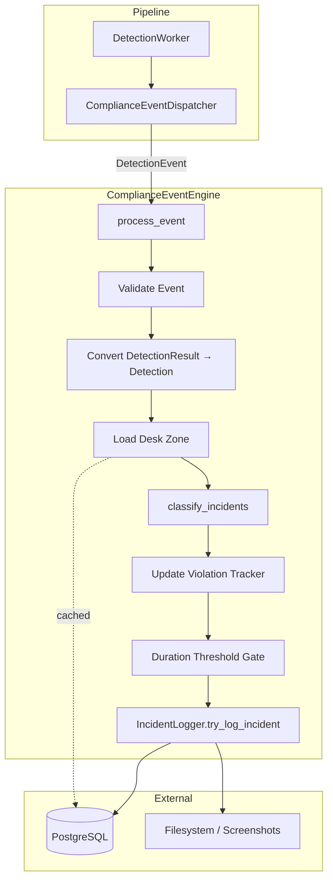
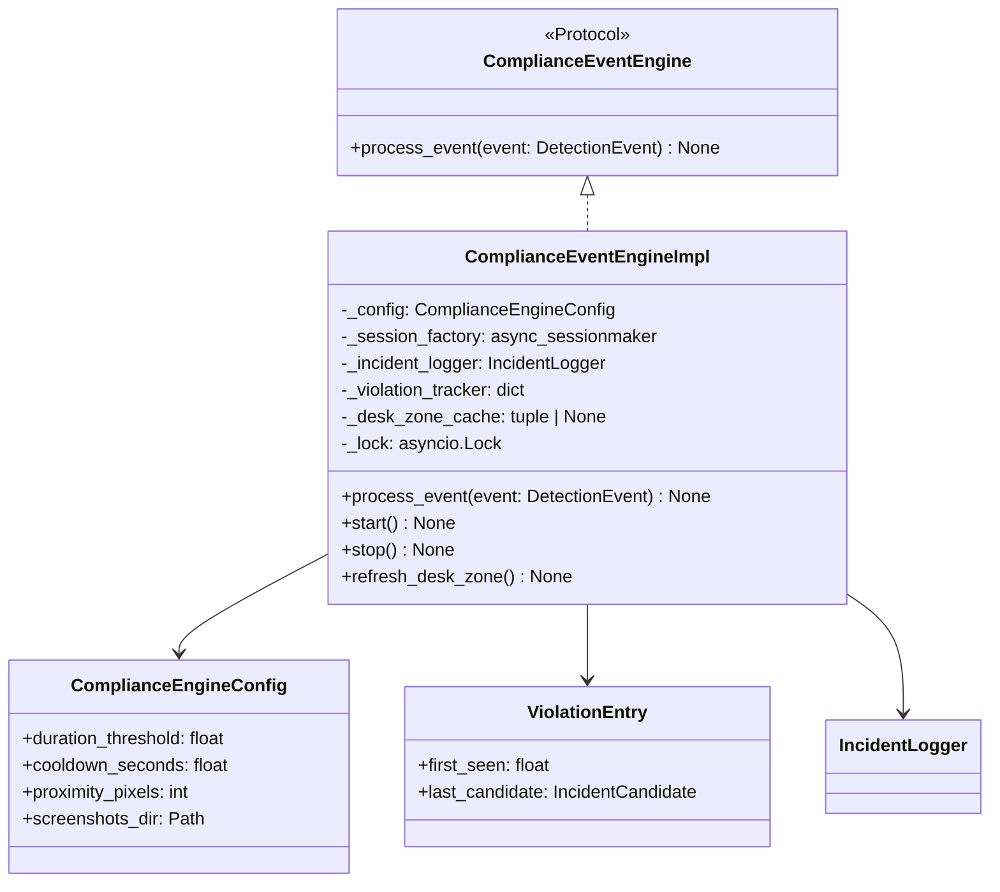

# Design Document: Compliance Event Engine

## Overview

The Compliance Event Engine is the downstream async service that receives `DetectionEvent` objects from the `ComplianceEventDispatcher` and orchestrates the full compliance workflow: converting raw detection results into typed `Detection` objects, applying spatial classification rules, tracking violation durations, and persisting confirmed incidents through the `IncidentLogger`.

The engine implements the `ComplianceEventEngine` protocol (defined in `backend/core/event_dispatcher.py`) and integrates with FastAPI's async lifespan for resource management. It is designed as a stateful, long-lived service that maintains violation tracking state in memory while delegating persistence and cooldown logic to the existing `IncidentLogger`.

### Key Design Decisions

1. **Stateful violation tracking in-memory** — The engine keeps a lightweight dict of first-seen timestamps per (camera_id, incident_type). This avoids database round-trips on every frame while accepting that state is lost on restart (acceptable since violations must re-accumulate from zero anyway).

2. **Delegation of cooldown/duration to IncidentLogger** — Cooldown suppression is handled entirely by the `IncidentLogger`, keeping the engine's responsibility focused on detection conversion, classification dispatch, and duration gating.

3. **Monotonic clock for duration tracking** — Uses `time.monotonic()` rather than wall clock to avoid issues with system clock adjustments.

4. **Graceful degradation** — If the database is unavailable at startup, the engine operates without zone-based classification. If individual event processing fails, the engine logs and continues.

## Architecture



### Component Relationships



## Components and Interfaces

### ComplianceEventEngineImpl

The main service class that implements the `ComplianceEventEngine` protocol.

**Constructor Parameters:**
| Parameter | Type | Description |
|-----------|------|-------------|
| `session_factory` | `async_sessionmaker[AsyncSession]` | Database session factory for zone queries and incident logging |
| `screenshots_dir` | `str \| Path` | Directory path for incident screenshots (max 260 chars) |
| `config` | `AppConfig \| ComplianceEngineConfig` | Configuration source |

**Public Methods:**
| Method | Signature | Description |
|--------|-----------|-------------|
| `process_event` | `async (event: DetectionEvent) -> None` | Main entry point — protocol method |
| `start` | `async () -> None` | Initialize tracker, load desk zone |
| `stop` | `async () -> None` | Clear state, wait for in-progress events |
| `refresh_desk_zone` | `async () -> None` | Re-read desk zone from DB |

### Detection Conversion

A pure function `convert_detection_result(result: DetectionResult) -> Detection | None` that:
1. Validates the `DetectionResult` (bbox keys present, confidence in [0.0, 1.0], label ≤ 20 chars)
2. Rounds bbox coordinates to nearest integer using half-up rounding
3. Returns a `Detection` dataclass or `None` if validation fails

### Violation Tracker

Internal dict structure: `dict[tuple[str, str], ViolationEntry]` keyed by `(camera_id, incident_type)`.

Operations:
- **Update**: For each incident candidate returned by classify_incidents, upsert tracking entry (keep earliest first_seen)
- **Prune**: Remove entries for incident types no longer present in current classification results for a given camera_id
- **Check threshold**: Compare `time.monotonic() - entry.first_seen` against `duration_threshold`
- **Reset**: After logging, reset first_seen so next continuous detection starts fresh

## Data Models

### ComplianceEngineConfig

```python
@dataclass(frozen=True)
class ComplianceEngineConfig:
    """Configuration for the Compliance Event Engine."""
    duration_threshold: float = 2.0    # seconds before logging (0.0 < x <= 300.0)
    cooldown_seconds: float = 10.0     # suppress duplicates (0.0 <= x <= 3600.0)
    proximity_pixels: int = 80         # phone-to-person distance (0 < x <= 2000)
    screenshots_dir: Path = Path("screenshots")

    @classmethod
    def from_app_config(cls, app_config: AppConfig) -> "ComplianceEngineConfig":
        """Derive engine config from the existing AppConfig."""
        return cls(
            duration_threshold=app_config.duration_threshold,
            cooldown_seconds=float(app_config.cooldown_seconds),
            proximity_pixels=app_config.proximity_pixels,
            screenshots_dir=Path(app_config.screenshots_dir),
        )

    def __post_init__(self) -> None:
        """Validate configuration constraints."""
        if not (0.0 < self.duration_threshold <= 300.0):
            raise ValueError(
                f"duration_threshold must be > 0.0 and <= 300.0, got {self.duration_threshold}"
            )
        if not (0.0 <= self.cooldown_seconds <= 3600.0):
            raise ValueError(
                f"cooldown_seconds must be >= 0.0 and <= 3600.0, got {self.cooldown_seconds}"
            )
        if not (0 < self.proximity_pixels <= 2000):
            raise ValueError(
                f"proximity_pixels must be > 0 and <= 2000, got {self.proximity_pixels}"
            )
```

### ViolationEntry

```python
@dataclass
class ViolationEntry:
    """Tracks an active violation's timing state."""
    first_seen: float        # time.monotonic() when first detected
    last_candidate: IncidentCandidate  # most recent candidate for this violation
```

### Data Flow Types

| Stage | Input Type | Output Type |
|-------|-----------|-------------|
| Receive | `DetectionEvent` | — |
| Convert | `DetectionResult` | `Detection \| None` |
| Classify | `list[Detection]` | `list[IncidentCandidate]` |
| Track | `IncidentCandidate` | `ViolationEntry` (upsert) |
| Gate | `ViolationEntry` | `bool` (threshold met?) |
| Log | `IncidentCandidate` | `int \| None` (incident_id) |


## Correctness Properties

*A property is a characteristic or behavior that should hold true across all valid executions of a system — essentially, a formal statement about what the system should do. Properties serve as the bridge between human-readable specifications and machine-verifiable correctness guarantees.*

### Property 1: Detection Conversion Round-Trip

*For any* valid `DetectionResult` with integer or float bbox values, confidence in [0.0, 1.0], label ≤ 20 characters, and all bbox keys present — converting to a `Detection` object and then extracting the bbox as a dict with keys (x1, y1, x2, y2) SHALL produce coordinate values equal to the half-up rounded integer values from the original `DetectionResult`, with confidence exactly preserved.

**Validates: Requirements 2.1, 2.2, 2.3, 2.6**

### Property 2: Invalid DetectionResult Filtering

*For any* list of `DetectionResult` objects where some have invalid fields (missing bbox keys, confidence outside [0.0, 1.0], or label exceeding 20 characters), the conversion function SHALL produce a list containing only the successfully converted valid items, and the length of the output list SHALL equal the count of valid items in the input list.

**Validates: Requirements 2.4**

### Property 3: Zone Percentage-to-Pixel Conversion

*For any* positive frame dimensions (width > 0, height > 0) and desk zone percentages (0–100 for each of x1, y1, x2, y2), the engine SHALL produce pixel coordinates identical to those returned by `table_zone_from_percent(frame_width, frame_height, x1_percent, y1_percent, x2_percent, y2_percent)`.

**Validates: Requirements 3.3**

### Property 4: Violation Tracker Timestamp Invariant

*For any* sequence of events containing the same (camera_id, incident_type) violation continuously, the Violation Tracker SHALL record the first-seen timestamp on the first occurrence and retain that exact timestamp value on all subsequent consecutive occurrences without modification.

**Validates: Requirements 4.1, 4.2**

### Property 5: Violation Tracker Pruning

*For any* violation tracking state and a new classification result for a given camera_id, after updating the tracker, the set of tracked (camera_id, incident_type) entries for that camera SHALL exactly equal the set of incident_types present in the current classification result. Entries for types no longer present are removed; entries for types still present are retained.

**Validates: Requirements 4.3, 8.2, 8.3**

### Property 6: Camera Independence

*For any* two distinct camera_ids, updating the violation tracker for one camera_id SHALL not modify, add, or remove any tracking entries for the other camera_id. The tracker state for each camera is an independent partition.

**Validates: Requirements 4.4**

### Property 7: Same-Type Deduplication Within Single Event

*For any* event that produces multiple `IncidentCandidate` objects with the same incident_type for the same camera_id, the Violation Tracker SHALL maintain exactly one tracking entry for that (camera_id, incident_type) combination, retaining the earliest first-seen timestamp already recorded.

**Validates: Requirements 4.5**

### Property 8: Duration Threshold Gate

*For any* `ViolationEntry` with first_seen timestamp `t0`, current monotonic time `t_now`, and configured `duration_threshold` value `d` (where 0 < d ≤ 300), the duration gate SHALL allow logging if and only if `(t_now - t0) >= d`. When `(t_now - t0) < d`, the candidate SHALL be suppressed.

**Validates: Requirements 5.1, 5.2, 5.3**

### Property 9: First-Seen Reset After Logging

*For any* violation that passes the duration threshold gate and is forwarded to the Incident Logger, the Violation Tracker SHALL reset the first-seen timestamp for that (camera_id, incident_type) entry so that the next continuous detection begins a new threshold period from the current time.

**Validates: Requirements 5.4**

### Property 10: Independent Candidate Processing

*For any* event producing N ≥ 2 `IncidentCandidate` objects that pass the duration gate, the engine SHALL invoke `try_log_incident` for each candidate independently. A failure (exception) or suppression (None return) for candidate i SHALL not prevent invocation for candidates i+1 through N.

**Validates: Requirements 6.5**

### Property 11: State Preservation on Pre-Tracking Failure

*For any* event processing that encounters an unrecoverable error before violation tracking updates are applied, the Violation Tracker dict SHALL remain identical to its state before the event began processing (no partial mutations).

**Validates: Requirements 12.3**

### Property 12: Configuration Validation

*For any* combination of `duration_threshold` (float), `cooldown_seconds` (float), and `proximity_pixels` (int), construction of `ComplianceEngineConfig` SHALL succeed if and only if `0.0 < duration_threshold ≤ 300.0` AND `0.0 ≤ cooldown_seconds ≤ 3600.0` AND `0 < proximity_pixels ≤ 2000`. For invalid values, a `ValueError` SHALL be raised whose message contains the name of the invalid parameter.

**Validates: Requirements 13.2, 13.3, 13.4, 13.5**

## Error Handling

### Error Categories and Responses

| Error Category | Source | Response | Log Level |
|---------------|--------|----------|-----------|
| Invalid event dimensions | DetectionEvent with width/height ≤ 0 | Skip classification, return early | WARNING |
| Invalid DetectionResult | Missing bbox keys, bad confidence/label | Skip individual result, continue batch | DEBUG |
| Database unavailable at startup | `start()` zone query fails | Initialize with zone = None | WARNING |
| Database unavailable during refresh | `refresh_desk_zone()` query fails | Retain cached zone value | WARNING |
| Database unavailable during logging | `try_log_incident()` raises | Log error, continue processing | ERROR |
| IncidentLogger exception | Any exception from `try_log_incident` | Log error, process next candidate | ERROR |
| Unhandled exception in process_event | Any unexpected error | Log with event context, return without re-raising | ERROR |
| Timeout on refresh_desk_zone | DB query exceeds 5 seconds | Raise TimeoutError, retain cache | WARNING |
| Partial tracking update failure | Exception after some tracker updates | Retain partial updates, log state | WARNING |

### Error Handling Strategy

1. **Fail-open for classification** — If zone data is unavailable, the engine continues without zone-based rules (PHONE_ON_TABLE and DOCUMENT_LEFT_ON_DESK are skipped, but PHONE_NEAR_PERSON still works).

2. **Isolation per candidate** — Each IncidentCandidate is processed independently within a try/except, so one failed logging attempt doesn't affect others.

3. **No re-raise from process_event** — The top-level handler catches all exceptions and returns gracefully, preventing one bad event from breaking the dispatcher's event loop.

4. **Consistent state on failure** — The engine snapshots tracker state before applying updates. If an error occurs before updates are applied, state is preserved unchanged. If an error occurs after partial updates, the partial state is retained (documented behavior per Requirement 12.4).

### Timeout Boundaries

| Operation | Timeout | Source |
|-----------|---------|--------|
| `process_event` overall | 3 seconds (enforced by dispatcher) | Requirement 1.2 |
| `refresh_desk_zone` DB query | 5 seconds | Requirement 10.4 |
| `stop()` waiting for in-progress event | 5 seconds | Requirement 9.3 |

## Testing Strategy

### Property-Based Tests (Hypothesis)

The project uses `pytest` + `hypothesis` for property-based testing. Each correctness property maps to a single Hypothesis test with a minimum of 100 iterations.

**Library:** `hypothesis` (already in backend/requirements.txt)

**Configuration:**
- Minimum 100 examples per property (`@settings(max_examples=100)`)
- Each test tagged with property reference comment

**Tag format:** `# Feature: compliance-event-engine, Property {N}: {title}`

**Properties to implement:**
| Property | Test Focus | Key Generators |
|----------|-----------|----------------|
| 1 | Detection conversion round-trip | Random DetectionResult with valid bbox dicts, float/int coords |
| 2 | Invalid result filtering | Mix of valid/invalid DetectionResult objects |
| 3 | Zone conversion | Random frame sizes (1–4000), zone percentages (0–100) |
| 4 | Timestamp invariant | Sequences of monotonic timestamps |
| 5 | Tracker pruning | Random prior state + random current results |
| 6 | Camera independence | Two random camera_ids, random mutations |
| 7 | Same-type deduplication | Events with duplicate incident_types |
| 8 | Duration threshold gate | Random (t0, t_now, threshold) triples |
| 9 | First-seen reset | Pre/post logging state comparison |
| 10 | Independent candidate processing | N candidates with random failures |
| 11 | State preservation on failure | Events with injected pre-tracking exceptions |
| 12 | Config validation | Random (duration, cooldown, proximity) tuples |

### Unit Tests (Example-Based)

Focus on specific scenarios not covered by properties:
- Empty event early return (Req 8.1)
- Screenshot directory creation on init (Req 1.4)
- `start()` / `stop()` lifecycle (Req 9.1, 9.2)
- Database failure at startup (Req 9.4)
- Exception logging with context (Req 12.1)
- IncidentLogger None return handling (Req 6.3)
- AppConfig → ComplianceEngineConfig derivation (Req 13.7)

### Integration Tests

- End-to-end flow: DetectionEvent → conversion → classification → tracking → logging
- Dispatcher timeout enforcement (3-second boundary)
- `refresh_desk_zone` with real async session mock
- `stop()` graceful shutdown with concurrent event processing

### Test File Location

All tests for this feature go in `backend/tests/test_compliance_engine.py`.
