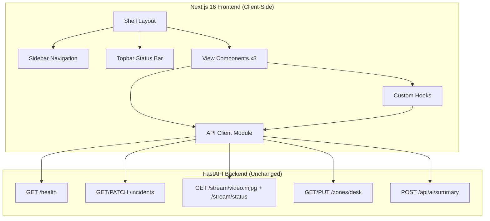
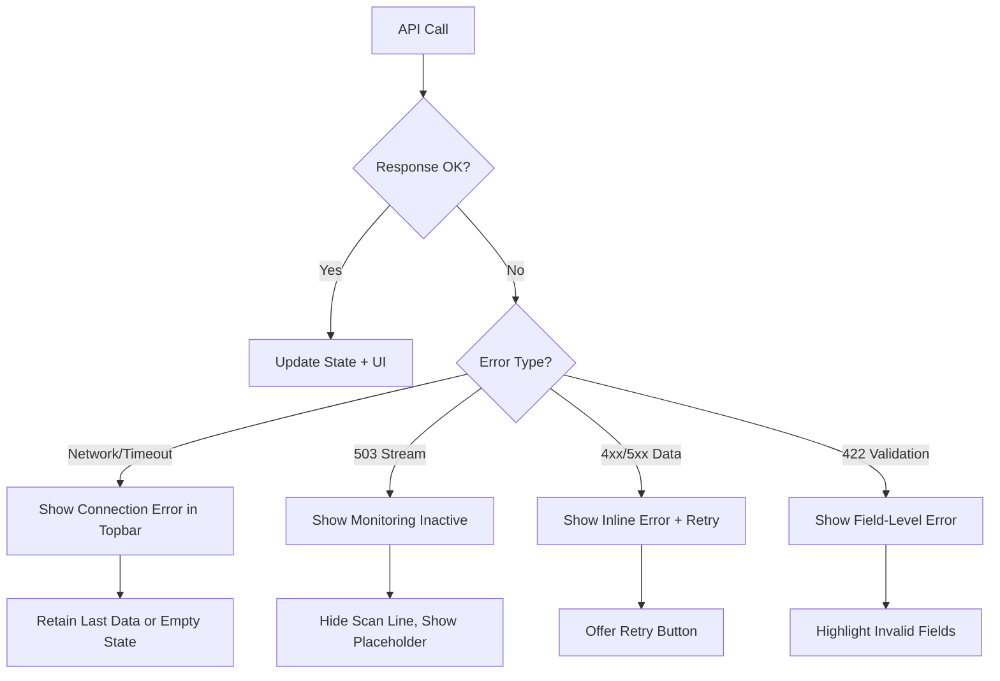

# Design Document: Dashboard Migration

## Overview

This design describes the migration of the CellphoneMonitoring frontend from a React 18 / Vite 5 / react-router-dom SPA to a Next.js 16 / React 19 application using shadcn/ui, pnpm, and client-side view switching. The new frontend implements an 8-view compliance monitoring dashboard consuming the existing FastAPI backend unchanged.

The migration is a full rewrite of the `frontend/` directory. The backend remains untouched except for the addition of a `POST /api/ai/summary` proxy endpoint for Amazon Bedrock integration.

### Key Design Decisions

1. **Client-side view switching over Next.js file-based routing** — All 8 views are rendered within a single page using React state to switch views. This avoids full-page transitions and preserves Shell state (sidebar collapse, clock, polling timers). Next.js is used for its build toolchain, React 19 support, and production optimization rather than server-side rendering.

2. **shadcn/ui components as the design system foundation** — Rather than building custom components, the dashboard uses shadcn/ui primitives (Card, Button, Badge, Table, etc.) customized with a dark glass-morphism theme via CSS custom properties.

3. **Axios API client layer with TypeScript interfaces** — A typed API module maps every backend endpoint to a function with explicit request/response types, providing compile-time safety and a single source of truth for backend contract.

4. **Polling over WebSocket** — The backend currently exposes REST + MJPEG endpoints with no WebSocket support. The frontend uses interval-based polling (2–30s depending on view) for data freshness.

5. **pnpm as package manager** — Faster installs, strict dependency resolution, and disk-efficient node_modules via hard links.

## Architecture



### Application Structure

```
frontend/
├── package.json                 # pnpm project config
├── pnpm-lock.yaml
├── next.config.ts               # Next.js 16 configuration
├── tsconfig.json                # TypeScript strict mode
├── postcss.config.mjs           # PostCSS with @tailwindcss/postcss
├── tailwind.config.ts           # Tailwind CSS v4 config
├── .env.local                   # NEXT_PUBLIC_API_URL
│
├── app/
│   ├── layout.tsx               # Root layout (html, body, font, providers)
│   ├── page.tsx                 # Single page rendering the Shell
│   └── globals.css              # CSS custom properties, dark theme tokens
│
├── components/
│   ├── shell/
│   │   ├── Shell.tsx            # Main layout: Sidebar + Topbar + content
│   │   ├── Sidebar.tsx          # Collapsible navigation (8 views)
│   │   └── Topbar.tsx           # Clock, status, AWS pill, notifications
│   │
│   ├── views/
│   │   ├── DashboardView.tsx    # Dashboard overview
│   │   ├── LiveMonitoringView.tsx
│   │   ├── ComplianceEventsView.tsx
│   │   ├── ComplianceReviewView.tsx
│   │   ├── AnalyticsView.tsx
│   │   ├── AwsServicesView.tsx
│   │   ├── SystemStatusView.tsx
│   │   └── SettingsView.tsx
│   │
│   ├── widgets/
│   │   ├── StatusCard.tsx       # Glass-morphism metric card
│   │   ├── EventFeed.tsx        # Scrollable event list
│   │   ├── AiAssistant.tsx      # Bedrock AI advisory panel
│   │   ├── ComplianceScore.tsx  # Percentage ring/bar
│   │   ├── HealthProgressBar.tsx # Color-coded health indicator
│   │   ├── GovernanceBadges.tsx # 9 data governance badges
│   │   └── StreamPreview.tsx    # MJPEG img + scan line overlay
│   │
│   └── ui/                      # shadcn/ui generated components
│       ├── avatar.tsx
│       ├── badge.tsx
│       ├── button.tsx
│       ├── card.tsx
│       ├── chart.tsx
│       ├── dropdown-menu.tsx
│       ├── input.tsx
│       ├── progress.tsx
│       ├── scroll-area.tsx
│       ├── select.tsx
│       ├── separator.tsx
│       ├── table.tsx
│       ├── tabs.tsx
│       └── tooltip.tsx
│
├── hooks/
│   ├── usePolling.ts            # Generic interval polling with cleanup
│   ├── useApiClient.ts          # API client instance accessor
│   ├── useViewState.ts          # Active view state management
│   └── useClock.ts              # Real-time HH:MM:SS clock
│
├── lib/
│   ├── api-client.ts            # Typed Axios client with all endpoint functions
│   ├── types.ts                 # TypeScript interfaces for all data models
│   ├── constants.ts             # View keys, polling intervals, theme tokens
│   └── utils.ts                 # Utility functions (cn, formatters)
│
└── public/
    └── ...                      # Static assets
```

## Components and Interfaces

### Shell Component

The Shell is the root UI component rendered by `app/page.tsx`. It manages:
- Active view state (`ViewKey` enum)
- Sidebar collapse state (boolean)
- Responsive sidebar visibility (hidden below 768px)

```typescript
interface ShellProps {
  children?: React.ReactNode;
}

type ViewKey =
  | "dashboard"
  | "live"
  | "events"
  | "review"
  | "analytics"
  | "aws"
  | "status"
  | "settings";
```

### Sidebar Component

```typescript
interface SidebarProps {
  activeView: ViewKey;
  onNavigate: (view: ViewKey) => void;
  collapsed: boolean;
  onToggleCollapse: () => void;
  visible: boolean; // For mobile show/hide
}

interface NavItem {
  key: ViewKey;
  label: string;
  icon: LucideIcon;
}
```

### Topbar Component

```typescript
interface TopbarProps {
  monitoredArea: string;
  isMonitoringActive: boolean;
  awsStatus: "operational" | "degraded" | "offline";
  onMenuToggle: () => void;
  sidebarVisible: boolean;
}
```

### API Client Module

```typescript
// lib/api-client.ts
import axios, { AxiosInstance } from "axios";

const BASE_URL = process.env.NEXT_PUBLIC_API_URL ?? "http://localhost:8000";

class ApiClient {
  private client: AxiosInstance;

  constructor() {
    this.client = axios.create({
      baseURL: BASE_URL,
      timeout: 10_000,
      headers: { "Content-Type": "application/json" },
    });
  }

  // Incidents
  async getIncidents(params?: IncidentQueryParams): Promise<ComplianceEvent[]>;
  async updateIncidentStatus(id: number, status: EventStatus): Promise<ComplianceEvent>;
  async exportIncidentsCsv(params?: IncidentQueryParams): Promise<Blob>;

  // Health
  async getHealth(): Promise<HealthStatus>;

  // Stream
  async getStreamStatus(): Promise<StreamMetrics>;
  getStreamUrl(): string; // Returns MJPEG URL

  // Zones
  async getDeskZone(): Promise<DeskZoneConfig>;
  async updateDeskZone(config: DeskZoneConfig): Promise<DeskZoneConfig>;

  // AI
  async getAiSummary(context: AiSummaryRequest): Promise<AiSummaryResponse>;
}
```

### Custom Hooks

```typescript
// hooks/usePolling.ts
function usePolling<T>(
  fetcher: () => Promise<T>,
  intervalMs: number,
  options?: { enabled?: boolean; onError?: (err: Error) => void }
): { data: T | null; loading: boolean; error: Error | null; refresh: () => void };

// hooks/useViewState.ts
function useViewState(): {
  activeView: ViewKey;
  setActiveView: (view: ViewKey) => void;
};

// hooks/useClock.ts
function useClock(): string; // Returns "HH:MM:SS"
```

### Widget Components

```typescript
// StatusCard
interface StatusCardProps {
  title: string;
  value: number;
  icon: LucideIcon;
  trend?: "up" | "down" | "neutral";
}

// EventFeed
interface EventFeedProps {
  events: ComplianceEvent[];
  loading: boolean;
  maxItems?: number;
}

// AiAssistant
interface AiAssistantProps {
  events: ComplianceEvent[];
  viewContext: ViewKey;
}

// HealthProgressBar
interface HealthProgressBarProps {
  label: string;
  value: number; // 0-100
  status: "healthy" | "warning" | "critical" | "unreachable";
}
```

## Data Models

### TypeScript Interfaces

```typescript
// lib/types.ts

/** Compliance event mapped from backend Incident model */
interface ComplianceEvent {
  id: number;
  title: string;
  detail: string;
  eventType: string;
  timestamp: string; // ISO 8601
  priority: ReviewPriority;
  status: EventStatus;
  confidence: number;
  zone: string;
  reviewer: string;
  notes: string;
}

type ReviewPriority = "High Review Priority" | "Needs Review" | "Informational";

type EventStatus =
  | "Pending Review"
  | "Confirmed"
  | "False Positive"
  | "Warning Issued"
  | "Coaching Required"
  | "Escalated"
  | "Resolved";

/** Backend GET /health response */
interface HealthStatus {
  status: "healthy" | "degraded" | "unhealthy";
  database: boolean;
  detection_engine_active: boolean;
  uptime_seconds: number;
}

/** Backend GET /stream/status response */
interface StreamMetrics {
  people: number;
  phones: number;
  active_rule_matches: number;
  logged_this_frame: number;
  inference_ms: number;
  fps: number;
  message: string;
}

/** Backend GET/PUT /zones/desk */
interface DeskZoneConfig {
  x1_percent: number;
  y1_percent: number;
  x2_percent: number;
  y2_percent: number;
}

/** AI summary request payload */
interface AiSummaryRequest {
  events: Array<{
    id: number;
    type: string;
    confidence: number;
    timestamp: string;
  }>;
  viewContext: string;
}

/** AI summary response */
interface AiSummaryResponse {
  summary: string;
  riskLevel: "Low" | "Medium" | "High" | "Critical";
  activeViolations: Record<string, number>;
  patterns: string;
}

/** Incident query parameters */
interface IncidentQueryParams {
  start_date?: string;
  end_date?: string;
  incident_type?: string;
  status?: string;
}

/** AWS service card display model */
interface AwsServiceCard {
  name: string;
  role: string;
  region: string;
  uptimePercent: number;
  status: "Operational" | "Degraded";
}
```

### Data Mapping: Backend → Frontend

| Backend Field | Frontend Field | Transformation |
|---|---|---|
| `incident_id` | `id` | Direct |
| `incident_type` | `detail` | Replace underscores with spaces |
| `incident_type` | `eventType` | Direct (raw value) |
| `incident_type` | `title` | Capitalize + replace underscores |
| `confidence` | `priority` | ≥0.85 → "High Review Priority", ≥0.50 → "Needs Review", <0.50 → "Informational" |
| `status` | `status` | "False Alarm" → "False Positive"; others direct |
| `camera_name` | `zone` | Direct |
| `timestamp` | `timestamp` | ISO string, formatted for display via `toLocaleString()` |
| `notes` | `reviewer` | Parse reviewer name if present, else "" |
| `notes` | `notes` | Direct |

### Component Health Derivation Logic

| Component | Source Endpoint | Healthy (100%) | Unhealthy (0%) |
|---|---|---|---|
| Camera | `GET /stream/status` | HTTP 200 | HTTP 503 or timeout (5s) |
| AI Engine | `GET /stream/status` | HTTP 200 AND `fps > 0` | Otherwise |
| Backend | `GET /health` | HTTP 200 | Timeout (5s) or error |
| Database | `GET /health` | HTTP 200 AND `database === true` | `database === false` or unreachable |
| AWS | Static config | Always 99.9% (placeholder) | N/A |
| Retention | `GET /health` | `status !== "unhealthy"` | `status === "unhealthy"` |

## Correctness Properties

*A property is a characteristic or behavior that should hold true across all valid executions of a system — essentially, a formal statement about what the system should do. Properties serve as the bridge between human-readable specifications and machine-verifiable correctness guarantees.*

### Property 1: Navigation state consistency

*For any* valid ViewKey, when the Shell renders with that ViewKey as the active view, exactly one sidebar navigation item shall have the active styling applied AND clicking any navigation item shall update the active view state to match the clicked item's ViewKey.

**Validates: Requirements 2.3, 2.5**

### Property 2: Status card count derivation

*For any* array of incident records with varying statuses, the status card counts shall equal: total events = array length, pending reviews = count where status is "Pending Review", confirmed violations = count where status is "Confirmed", false positives = count where status is "False Alarm".

**Validates: Requirements 3.2**

### Property 3: Incident mapping with priority derivation

*For any* valid backend incident response object (containing incident_id, incident_type, confidence in [0,1], camera_name, timestamp, status, and notes), the mapping function shall produce a ComplianceEvent where: detail equals incident_type with underscores replaced by spaces, zone equals camera_name, priority equals "High Review Priority" when confidence >= 0.85, "Needs Review" when confidence >= 0.50 and < 0.85, and "Informational" when confidence < 0.50, and status maps "False Alarm" to "False Positive" while preserving other status values.

**Validates: Requirements 5.4, 13.2**

### Property 4: Event rendering completeness

*For any* valid ComplianceEvent object, the rendered event feed item shall contain the event id, the formatted detail string, a formatted timestamp string, a priority badge matching the event's priority, a status badge matching the event's status, and the zone value.

**Validates: Requirements 5.3**

### Property 5: Text search filtering

*For any* array of ComplianceEvents and any non-empty search string, the filtered results shall contain only events where at least one of the fields (id as string, detail, zone, or reviewer) contains the search string as a case-insensitive substring, and shall contain ALL events that match this criterion.

**Validates: Requirements 6.2**

### Property 6: Compliance score calculation

*For any* array of incidents with varying statuses, the compliance score percentage shall equal (count of incidents with status other than "Pending Review" / total incident count) * 100, yielding a value between 0 and 100 inclusive, and shall be 0 when the total count is 0.

**Validates: Requirements 7.5**

### Property 7: Component health derivation and color coding

*For any* combination of stream status response (HTTP 200 with fps field, or HTTP 503/timeout) and health response (HTTP 200 with database and detection_engine_active booleans, or timeout), the derived health values shall be: Camera = 100 if stream returns 200 else 0, AI Engine = 100 if stream returns 200 AND fps > 0 else 0, Backend = 100 if health returns 200 else 0, Database = 100 if health returns 200 AND database is true else 0. Furthermore, *for any* derived health value in [0, 100], the progress bar color shall be green if value > 90, amber if 70 <= value <= 90, and red if value < 70.

**Validates: Requirements 8.4, 9.3, 9.4, 9.5, 9.6, 9.7**

### Property 8: AI summary debounce

*For any* sequence of event arrivals within a 30-second window, the AI summary request shall be made at most once, with subsequent arrivals within the window being discarded until the debounce period elapses.

**Validates: Requirements 11.3**

### Property 9: AI response truncation

*For any* string response from the AI backend proxy, if the string length exceeds 2000 characters, the rendered output shall display exactly 2000 characters followed by a truncation indicator. If the string length is 2000 characters or fewer, the full string shall be displayed without a truncation indicator.

**Validates: Requirements 11.6**

## Error Handling

### Strategy: Graceful Degradation with Widget Isolation

Each dashboard widget operates independently. A failure in one widget's data source does not cascade to others.

### Error Categories

| Category | Behavior | UI Indication |
|---|---|---|
| Network timeout (>10s) | Show last data or empty state | Connection error in Topbar + per-widget error |
| HTTP 503 on stream | Switch to "Monitoring Inactive" state | Placeholder with reduced opacity |
| HTTP 4xx/5xx on data | Show error message with retry | Inline error card with retry button |
| HTTP 422 on save | Display validation error | Error message replaces success toast |
| AI proxy timeout (>15s) | Show error with manual retry | Error state + retry button in AI panel |

### Error Flow



### Retry Strategy

- Automatic retry: Polling endpoints automatically retry on next poll cycle
- Manual retry: One-shot requests (fetch events, save zone, AI summary) offer a retry button
- No exponential backoff for polling (fixed interval is sufficient for dashboard use)

### State Preservation

- On error, the last successfully fetched data remains displayed
- If no prior data exists (first load failure), show empty state placeholder
- Toggle states (Settings) are preserved in localStorage even if save fails

## Testing Strategy

### Dual Testing Approach

This feature benefits from both property-based testing (for data transformation and filtering logic) and example-based unit tests (for rendering, integration, and specific scenarios).

### Property-Based Testing

**Library**: [fast-check](https://github.com/dubzzz/fast-check) (TypeScript PBT library for the frontend)

**Configuration**:
- Minimum 100 iterations per property test
- Each test tagged with: `Feature: dashboard-migration, Property {N}: {title}`

**Properties to implement**:

| Property | Module Under Test | Generator Strategy |
|---|---|---|
| P1: Navigation state | Shell/Sidebar components | Arbitrary ViewKey from enum |
| P2: Status card counts | Dashboard count logic | Array of incidents with random statuses |
| P3: Incident mapping | API mapping function | Random incident objects with confidence in [0,1] |
| P4: Event rendering | EventFeed component | Random ComplianceEvent objects |
| P5: Text search | Filter function | Random events + random search strings |
| P6: Compliance score | Score calculation | Random incident arrays with mixed statuses |
| P7: Health derivation + color | Health logic + color function | Random API responses (200/503) + random percentages |
| P8: Debounce | useDebounce hook | Random event arrival timestamps |
| P9: Truncation | Text truncation utility | Random strings of varying lengths |

### Unit Tests (Example-Based)

- Rendering tests for each view component (verifying DOM structure)
- Specific error scenarios (503, 422, network timeout)
- Accessibility checks (ARIA attributes, focus management)
- Responsive layout breakpoint behavior
- localStorage toggle persistence
- CSS class application (glass-morphism, pulse animation)

### Integration Tests

- API client calls with mocked Axios responses
- Polling hook lifecycle (start, stop, cleanup)
- Full view render with mocked API layer
- CSV export download trigger

### Test File Structure

```
frontend/
├── __tests__/
│   ├── properties/           # Property-based tests
│   │   ├── navigation.prop.test.ts
│   │   ├── incident-mapping.prop.test.ts
│   │   ├── search-filter.prop.test.ts
│   │   ├── health-derivation.prop.test.ts
│   │   ├── status-counts.prop.test.ts
│   │   ├── compliance-score.prop.test.ts
│   │   ├── debounce.prop.test.ts
│   │   └── truncation.prop.test.ts
│   │
│   ├── unit/                 # Example-based unit tests
│   │   ├── Shell.test.tsx
│   │   ├── Sidebar.test.tsx
│   │   ├── Topbar.test.tsx
│   │   ├── DashboardView.test.tsx
│   │   ├── LiveMonitoringView.test.tsx
│   │   ├── ComplianceEventsView.test.tsx
│   │   ├── ComplianceReviewView.test.tsx
│   │   ├── AnalyticsView.test.tsx
│   │   ├── AwsServicesView.test.tsx
│   │   ├── SystemStatusView.test.tsx
│   │   ├── SettingsView.test.tsx
│   │   ├── AiAssistant.test.tsx
│   │   └── GovernanceBadges.test.tsx
│   │
│   └── integration/          # Integration tests
│       ├── api-client.test.ts
│       ├── polling.test.ts
│       └── error-handling.test.ts
│
├── vitest.config.ts          # Vitest configuration
└── setup-tests.ts            # Test setup (jsdom, mocks)
```

### Test Runner

- **Vitest** — Fast, Vite-compatible test runner with native TypeScript support
- **@testing-library/react** — Component rendering and assertions
- **fast-check** — Property-based testing
- **msw** (Mock Service Worker) — API mocking for integration tests

