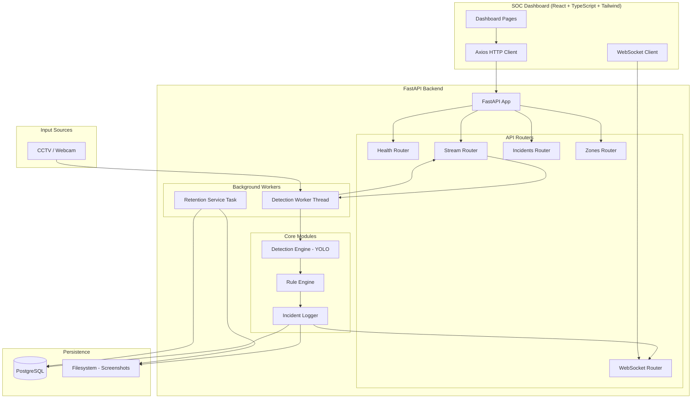

# Design Document: Security Monitoring System

## Overview

The Security Monitoring System is a computer vision application that detects information security policy violations in restricted production workspaces. It processes live CCTV/webcam feeds using YOLOv8 object detection, classifies violations using spatial rules, logs incidents with evidence, and provides a real-time SOC (Security Operations Command Center) dashboard.

The system follows a two-tier architecture: a **FastAPI backend** handling detection, incident management, and data lifecycle, and a **React TypeScript frontend** providing the SOC dashboard interface. Communication between tiers uses REST APIs, MJPEG streaming, and WebSocket connections.

### Key Design Decisions

- **YOLOv8n model**: Chosen for its balance of speed (~500ms/frame on CPU) and accuracy for the hackathon MVP scope
- **Background thread for detection**: The detection loop runs in a dedicated thread with its own asyncio event loop to avoid blocking the FastAPI async request handlers
- **PostgreSQL**: Selected for data integrity, indexing on timestamp/type/status columns, and production readiness
- **MJPEG streaming**: Provides browser-native video display without requiring WebRTC complexity
- **WebSocket for alerts**: Enables sub-second incident notification without polling overhead

## Architecture



### Data Flow

1. **Detection Pipeline**: Camera → DetectionWorker → YoloDetector → RuleEngine → IncidentLogger → DB + Screenshots
2. **Live Stream**: DetectionWorker annotates frames → StreamRouter delivers MJPEG → Dashboard renders
3. **WebSocket Alerts**: IncidentLogger persists → WebSocketRouter broadcasts → Dashboard appends to feed
4. **Retention**: RetentionService (scheduled) → queries expired records → deletes records + files + orphans

## Components and Interfaces

### Backend Components

#### 1. Detection Engine (`backend/core/detector.py`)

**Responsibility**: Wraps Ultralytics YOLO model to detect target objects in video frames.

```python
@dataclass(frozen=True)
class Detection:
    label: str              # "person", "cell phone", "book"
    confidence: float       # 0.0 to 1.0
    bbox: tuple[int, int, int, int]  # (x1, y1, x2, y2) pixel coords
    class_id: int

class YoloDetector:
    TARGET_LABELS = {"person", "cell phone", "book"}
    
    def detect(self, frame: np.ndarray, confidence_threshold: float, image_size: int) -> list[Detection]
```

**Contracts**:
- Input: BGR numpy array (video frame), confidence threshold (0.10–0.95), image size
- Output: List of Detection objects with confidence ≥ threshold
- Side effects: None (pure detection, no state mutation)

#### 2. Rule Engine (`backend/core/rules.py`)

**Responsibility**: Classifies detections into security violation types based on spatial relationships.

```python
@dataclass(frozen=True)
class IncidentCandidate:
    incident_type: str      # PHONE_ON_TABLE | PHONE_NEAR_PERSON | DOCUMENT_LEFT_ON_DESK
    confidence: float
    phone_bbox: tuple[int, int, int, int]
    person_bbox: tuple[int, int, int, int] | None

def table_zone_from_percent(frame_width, frame_height, x1_percent, y1_percent, x2_percent, y2_percent) -> tuple[int, int, int, int]

def classify_incidents(detections: list[Detection], table_zone: tuple[int, int, int, int], proximity_pixels: int) -> list[IncidentCandidate]
```

**Contracts**:
- `classify_incidents` is a pure function: same inputs always produce same outputs
- PHONE_NEAR_PERSON takes priority over PHONE_ON_TABLE for the same phone
- Each phone is evaluated independently
- Returns empty list when no violations detected

#### 3. Incident Logger (`backend/core/incident_logger.py`)

**Responsibility**: Persists confirmed violations with duration gating, cooldown suppression, and screenshot capture.

```python
class IncidentLogger:
    async def try_log_incident(candidate, frame, camera_name, location) -> int | None
```

**Contracts**:
- Only logs after violation persists beyond `duration_threshold` seconds
- Suppresses duplicate logging within `cooldown_seconds` window
- Captures annotated frame as JPEG screenshot with timestamp+type filename
- Falls back gracefully if screenshot write fails (empty path + notes)
- Returns incident_id on success, None if suppressed

#### 4. Retention Service (`backend/workers/retention_service.py`)

**Responsibility**: Enforces 7-day data lifecycle policy via scheduled background task.

```python
class RetentionService:
    async def run_cleanup() -> RetentionResult
```

**Contracts**:
- Deletes records where timestamp > 7 days old
- Deletes associated screenshot files
- Deletes orphan screenshots (unreferenced + older than 7 days)
- Continues processing on individual file deletion errors
- Logs counts after every execution (including zeros)

#### 5. Detection Worker (`backend/workers/detection_worker.py`)

**Responsibility**: Background thread running the continuous detection loop.

```python
class DetectionWorker:
    def start() -> None
    def stop() -> None
    def get_latest_frame() -> bytes | None
    def get_status() -> dict[str, Any]
    def wait_for_frame(last_frame_id, timeout) -> tuple[int, bytes | None]
```

**Contracts**:
- Runs in dedicated daemon thread with its own asyncio event loop
- Publishes annotated JPEG frames at configured UI fps
- Refreshes desk zone config from DB every 30 seconds
- Resets incident tracking when violation types disappear from frame

#### 6. WebSocket Manager (`backend/routers/websocket.py`)

**Responsibility**: Manages WebSocket connections and broadcasts incident events.

```python
class WebSocketManager:
    async def connect(websocket: WebSocket) -> None
    async def disconnect(websocket: WebSocket) -> None
    async def broadcast(message: dict) -> None
```

**Contracts**:
- Supports at least 10 simultaneous connections
- Broadcasts within 1 second of incident persistence
- Message format: `{"type": "new_incident", "data": {...}}`
- Removes failed connections silently, continues broadcasting to others
- Discards messages when no clients connected

### API Endpoints

| Method | Path | Description |
|--------|------|-------------|
| GET | `/health` | Health check with DB and engine status |
| GET | `/stream/video.mjpg` | MJPEG annotated video stream |
| GET | `/stream/status` | Real-time detection metrics JSON |
| GET | `/api/cameras` | Camera list with online/offline status |
| GET | `/api/status` | System health (ai_engine, database, websocket) |
| GET | `/incidents` | Filtered incident list (max 100, desc timestamp) |
| GET | `/incidents/export` | CSV export of filtered incidents |
| PATCH | `/incidents/{id}/status` | Update incident review status |
| GET | `/zones` | Current desk zone configuration |
| PUT | `/zones` | Update desk zone percentages |
| WS | `/ws/incidents` | Real-time incident event stream |

### Frontend Components

#### Page Components (`pages/`)
- `dashboard.tsx` — Main SOC overview with status cards, live feed, detection feed, analytics
- `incidents.tsx` — Incident Review with filterable paginated table
- `cameras.tsx` — Camera management view
- `audit.tsx` — Audit logs view
- `settings.tsx` — System settings

#### Reusable Components (`components/`)
- `Sidebar` — Persistent dark-themed left navigation
- `CameraPanel` — Live MJPEG feed with bounding box overlay
- `IncidentCard` — Single incident display
- `DetectionFeed` — Scrolling real-time event list (max 50 entries, FIFO)
- `AnalyticsGraph` — Recharts incidents-per-hour chart
- `SecurityStatus` — System health indicators panel
- `AlertBanner` — Dismissible notification banner (visible ≥5s)
- `StatusCard` — Compact metric card for the top bar

#### Services (`services/`)
- `api.ts` — Axios-based HTTP client for all REST endpoints
- `websocket.ts` — WebSocket connection manager with 5-second reconnect

#### Hooks (`hooks/`)
- `useWebSocket` — WebSocket subscription with connection state and messages
- `usePolling` — Periodic data fetching with configurable interval

## Data Models

### PostgreSQL Schema

```sql
CREATE TABLE incidents (
    incident_id    SERIAL PRIMARY KEY,
    timestamp      TIMESTAMP NOT NULL,
    incident_type  VARCHAR(50) NOT NULL,
    confidence     FLOAT NOT NULL CHECK (confidence >= 0.0 AND confidence <= 1.0),
    camera_name    VARCHAR(100) NOT NULL,
    location       VARCHAR(200) NOT NULL,
    screenshot_path VARCHAR(500) NOT NULL DEFAULT '',
    status         VARCHAR(20) NOT NULL DEFAULT 'Pending Review'
                   CHECK (status IN ('Pending Review', 'Confirmed', 'False Alarm')),
    notes          TEXT NOT NULL DEFAULT '',
    created_at     TIMESTAMP NOT NULL DEFAULT NOW()
);

CREATE INDEX idx_incidents_timestamp ON incidents (timestamp);
CREATE INDEX idx_incidents_type ON incidents (incident_type);
CREATE INDEX idx_incidents_status ON incidents (status);

CREATE TABLE desk_zone_config (
    id          INTEGER PRIMARY KEY DEFAULT 1 CHECK (id = 1),
    x1_percent  INTEGER NOT NULL DEFAULT 20 CHECK (x1_percent >= 0 AND x1_percent <= 100),
    y1_percent  INTEGER NOT NULL DEFAULT 35 CHECK (y1_percent >= 0 AND y1_percent <= 100),
    x2_percent  INTEGER NOT NULL DEFAULT 80 CHECK (x2_percent >= 0 AND x2_percent <= 100),
    y2_percent  INTEGER NOT NULL DEFAULT 75 CHECK (y2_percent >= 0 AND y2_percent <= 100),
    updated_at  TIMESTAMP NOT NULL DEFAULT NOW()
);
```

### Key Data Structures

```python
# Detection pipeline output
Detection(label="cell phone", confidence=0.87, bbox=(120, 200, 250, 380), class_id=67)

# Rule engine output
IncidentCandidate(incident_type="PHONE_ON_TABLE", confidence=0.87, phone_bbox=(120, 200, 250, 380), person_bbox=None)

# WebSocket event payload
{
    "type": "new_incident",
    "data": {
        "incident_id": 42,
        "timestamp": "2024-01-15T14:23:45",
        "incident_type": "PHONE_ON_TABLE",
        "confidence": 0.87,
        "camera_name": "Camera 1",
        "status": "Pending Review"
    }
}

# Stream status response
{
    "people": 2,
    "phones": 1,
    "active_rule_matches": 1,
    "logged_this_frame": 0,
    "inference_ms": 142.3,
    "fps": 2.1
}
```

### Screenshot File Naming

Format: `incident_{YYYYMMDD}_{HHMMSSfff}_{INCIDENT_TYPE}.jpg`

Example: `incident_20240115_142345087_PHONE_ON_TABLE.jpg`

## Correctness Properties

*A property is a characteristic or behavior that should hold true across all valid executions of a system — essentially, a formal statement about what the system should do. Properties serve as the bridge between human-readable specifications and machine-verifiable correctness guarantees.*

### Property 1: Confidence threshold filtering

*For any* list of detections and any valid confidence threshold (0.10–0.95), the filtered output SHALL contain only detections with confidence ≥ threshold, and all detections with confidence ≥ threshold from the input SHALL be present in the output.

**Validates: Requirements 1.3, 1.6**

### Property 2: Center-inside-zone violation classification

*For any* object bounding box and any desk zone rectangle, if the center point of the bounding box falls inside the zone, the rule engine SHALL classify it as the appropriate violation type (PHONE_ON_TABLE for "cell phone", DOCUMENT_LEFT_ON_DESK for "book"/"paper document"), provided no higher-priority rule applies.

**Validates: Requirements 2.1, 2.3**

### Property 3: Phone-near-person proximity classification

*For any* "cell phone" bounding box and "person" bounding box, if the boxes overlap OR the edge-to-edge distance from the phone center to the person box is ≤ proximity_pixels, the rule engine SHALL classify it as PHONE_NEAR_PERSON.

**Validates: Requirements 2.2**

### Property 4: PHONE_NEAR_PERSON priority over PHONE_ON_TABLE

*For any* "cell phone" detection that satisfies both the PHONE_ON_TABLE rule (center inside desk zone) and the PHONE_NEAR_PERSON rule (overlap or proximity to a person), the rule engine SHALL produce exactly one violation of type PHONE_NEAR_PERSON and zero violations of type PHONE_ON_TABLE for that phone.

**Validates: Requirements 2.4**

### Property 5: Independent evaluation of multiple phones

*For any* frame containing N "cell phone" detections (N ≥ 1), the rule engine SHALL evaluate each phone independently, producing at most one violation per phone, with the total violations count equal to the number of phones that individually satisfy at least one rule.

**Validates: Requirements 2.6**

### Property 6: Duration threshold gating

*For any* incident type and any duration threshold value (0.5–10.0 seconds), the incident logger SHALL NOT persist an incident if the violation has been continuously observed for less than the threshold duration, and SHALL persist it once the threshold is exceeded.

**Validates: Requirements 3.1**

### Property 7: Cooldown suppression

*For any* incident type and any cooldown period (1–60 seconds), if an incident of that type was logged at time T, then any subsequent detection of the same type at time T+Δ where Δ < cooldown SHALL be suppressed, and a detection at time T+Δ where Δ ≥ cooldown SHALL be eligible for logging.

**Validates: Requirements 3.4**

### Property 8: Screenshot filename contains timestamp and incident type

*For any* timestamp and any valid incident type string, the generated screenshot filename SHALL contain the date and time components to millisecond precision AND the incident type string, ensuring uniqueness across simultaneous incidents of different types.

**Validates: Requirements 3.3**

### Property 9: Retention deletes expired records and associated files

*For any* set of incident records, after retention cleanup executes, all records with timestamp older than 7 days (168 hours) SHALL be removed from the database, and their corresponding screenshot files (if they exist on disk) SHALL be deleted from the filesystem.

**Validates: Requirements 4.1, 4.2**

### Property 10: Orphan screenshot cleanup

*For any* screenshot file in the configured directory that is NOT referenced by any existing incident record AND has a file modification time older than 7 days, the retention service SHALL delete that file during cleanup.

**Validates: Requirements 4.7**

### Property 11: Incident query filter correctness

*For any* combination of date range, incident type, and status filters applied to a set of incident records, the returned results SHALL contain only records that match ALL active filter criteria (AND logic), the result count SHALL NOT exceed 100, and no matching record within the limit SHALL be omitted.

**Validates: Requirements 6.1**

### Property 12: Incident query sort order invariant

*For any* non-empty query result set, every consecutive pair of incidents (result[i], result[i+1]) SHALL satisfy result[i].timestamp ≥ result[i+1].timestamp (descending order).

**Validates: Requirements 6.4**

### Property 13: Invalid status rejection

*For any* string value that is NOT one of "Pending Review", "Confirmed", or "False Alarm", an incident status update request containing that value SHALL be rejected with an error response.

**Validates: Requirements 6.3**

### Property 14: Desk zone validation

*For any* four integer values (x1, y1, x2, y2), the desk zone configuration SHALL be accepted if and only if all four values are within the inclusive range [0, 100]. Any value outside this range SHALL cause the request to be rejected with an error indicating the invalid value and acceptable range.

**Validates: Requirements 9.1, 9.5**

### Property 15: Percentage-to-pixel coordinate conversion with normalization

*For any* valid percentage values (0–100) and any positive frame dimensions (width, height), the `table_zone_from_percent` function SHALL produce pixel coordinates where the top-left corner is (min(x1_px, x2_px), min(y1_px, y2_px)) and the bottom-right corner is (max(x1_px, x2_px), max(y1_px, y2_px)), ensuring a valid rectangle regardless of input order.

**Validates: Requirements 9.2**

## Error Handling

### Detection Engine Errors

| Error | Handling | Recovery |
|-------|----------|----------|
| Camera source unavailable | Report to API_Server with source ID and reason | DetectionWorker retries frame read; reports status "No frame available" |
| YOLO model load failure | Log error, terminate worker | Worker sets `is_running=False`; stream endpoint returns 503 |
| YOLO inference exception | Log error, break detection loop | Worker stops; requires restart |
| Frame decode failure | Skip frame, continue loop | Log warning, sleep 200ms, retry next frame |

### Incident Logger Errors

| Error | Handling | Recovery |
|-------|----------|----------|
| Screenshot write failure | Set screenshot_path="" and notes="Screenshot capture failed" | Incident record still persisted to DB |
| Database write failure | Log error, propagate exception | DetectionWorker catches and logs; continues processing next frame |
| cv2.imencode failure | Return empty string path | Same as screenshot write failure |

### Retention Service Errors

| Error | Handling | Recovery |
|-------|----------|----------|
| File not found on delete | Skip silently (Req 4.4) | Continue to next record |
| Permission denied on delete | Log file path, add to errors list | Continue processing remaining records (Req 4.5) |
| Database query failure | Log error | Retry on next scheduled execution |
| Screenshot directory listing error | Log error, skip orphan cleanup | Record deletion still proceeds |

### API/WebSocket Errors

| Error | Handling | Recovery |
|-------|----------|----------|
| DB connection failure on startup | Log error, `sys.exit(1)` (Req 8.6) | Requires operator intervention |
| WebSocket client disconnect | Remove from active list silently | Continue broadcasting to remaining clients |
| WebSocket send failure | Remove failed client | No queue, message discarded for that client |
| Invalid status update value | Return 422 with validation error | Client retries with valid value |
| Incident not found (404) | Return error with message | Client handles missing resource |
| No active worker (503) | Return JSON `{"detail": "Monitoring is not active"}` | Client displays disconnected state |

### Frontend Error Handling

| Error | Handling | Recovery |
|-------|----------|----------|
| MJPEG feed timeout (10s) | Display "Feed Disconnected" overlay | Continue attempting to load |
| WebSocket connection lost | Display "Connection Lost" indicator | Auto-reconnect every 5 seconds |
| API server unreachable | Display error banner with retry button | Poll /health every 10 seconds |
| Route not found | Render 404 fallback page | Link back to /dashboard |

## Testing Strategy

### Property-Based Testing (Hypothesis)

The system uses the **Hypothesis** library (already in requirements.txt) for property-based testing of core logic modules. Each property test runs a minimum of **100 iterations** with generated inputs.

**Target modules for PBT:**
- `backend/core/rules.py` — Rule engine spatial classification (Properties 2–5, 15)
- `backend/core/detector.py` — Confidence filtering logic (Property 1)
- `backend/core/incident_logger.py` — Duration gating, cooldown suppression, filename generation (Properties 6–8)
- `backend/workers/retention_service.py` — Retention logic (Properties 9–10)
- `backend/routers/incidents.py` — Query filtering and validation (Properties 11–14)
- `backend/routers/zones.py` — Zone validation (Property 14)

**Property test configuration:**
- Minimum 100 examples per property (`@settings(max_examples=100)`)
- Each test tagged with: `# Feature: security-monitoring-system, Property {N}: {title}`
- Generators produce realistic data: bounding boxes within frame bounds, confidence values in [0, 1], timestamps spanning retention windows

### Unit Tests (pytest)

Example-based tests for specific behaviors:
- Screenshot write failure graceful degradation
- Default status "Pending Review" assignment
- Camera unavailability error message format
- CSV export column order and content
- Non-existent incident_id returns 404
- Health endpoint response within 500ms
- WebSocket message format validation

### Integration Tests

- API endpoint response codes and headers (503, Cache-Control)
- Database startup failure exits with code 1
- MJPEG stream content-type and boundary format
- WebSocket connection establishment and broadcast
- Retention service scheduled execution interval
- CORS configuration acceptance from configured origins

### Frontend Tests

- Component rendering with React Testing Library
- Route navigation and fallback page
- WebSocket reconnection behavior (mock)
- Polling interval configuration
- Detection feed FIFO behavior (max 50 entries)
- Alert banner auto-dismiss after 5 seconds
